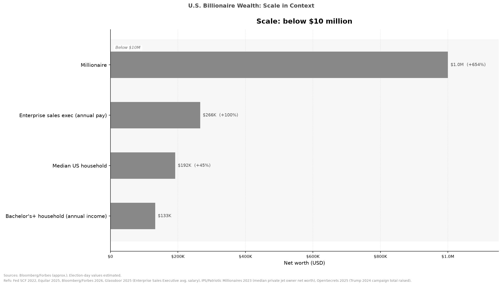
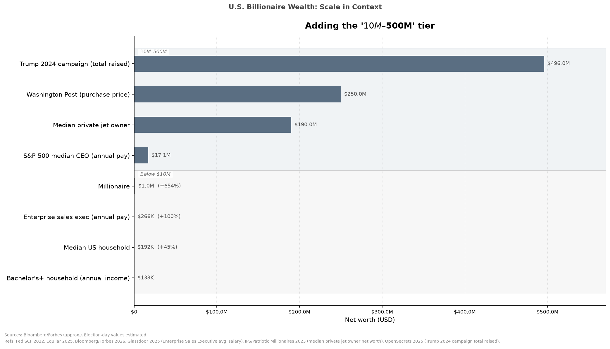
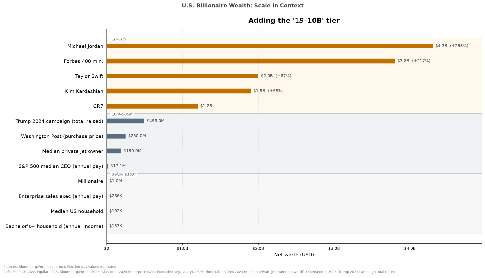
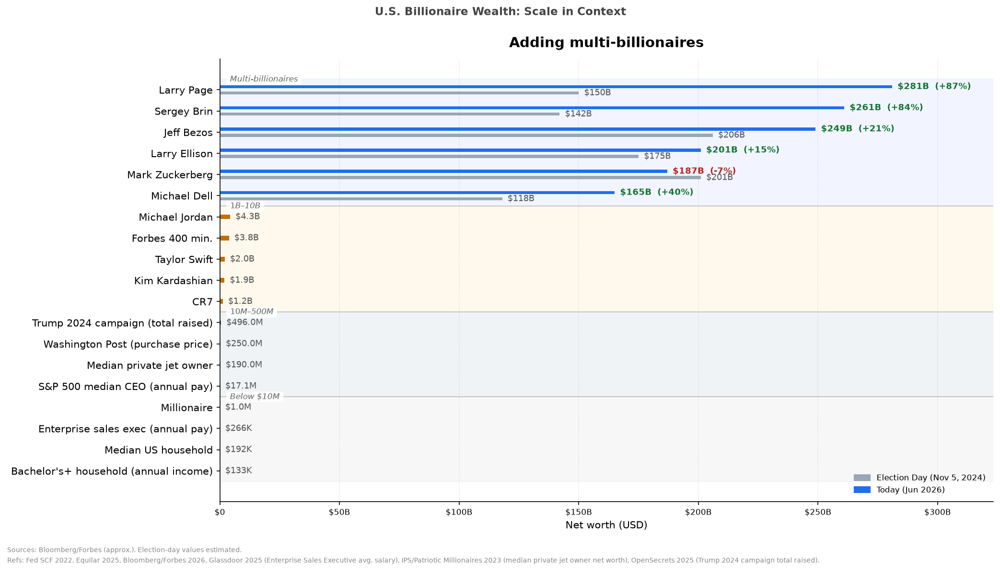
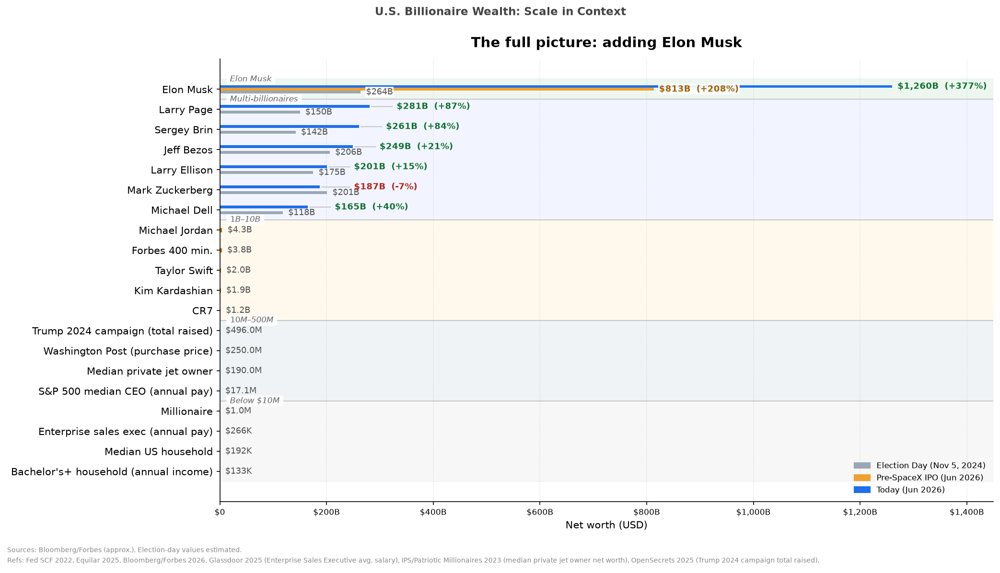

# Social Figures

Data visualizations on social, political, and economic topics, built with Jupyter and matplotlib.

## Charts

### 1. U.S. Billionaire Wealth: Scale in Context (`billionaire_wealth_chart_v*.ipynb`)

A five-slide sequence that builds up from household income to Elon Musk, zooming the x-axis out at each step so the previous tier shrinks toward zero. The shrinking is the point.

Each slide adds one group:
1. Below $10M — household and executive pay reference points
2. $10M–$500M — campaign totals, private jets, CEO pay
3. $1B–$10B — athletes and entertainers
4. Multi-billionaires — election-day vs. today wealth
5. Elon Musk — election-day, pre-SpaceX IPO, today

All values in USD billions. Sources documented in [`sources.md`](sources.md).

### Slides







## Setup

```bash
python -m venv .venv
.venv\Scripts\activate
pip install jupyter matplotlib numpy
```

Running the notebook generates `billionaire_wealth_slides.pdf` with all 5 slides.